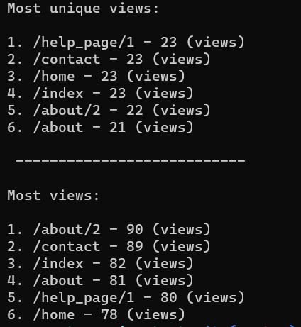
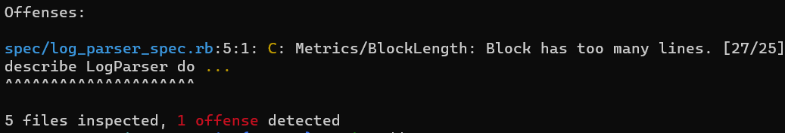

# Webparser program (Ruby)

## Table of Contents
* [General info](#general-info)
* [Technologies](#technologies)
* [Setup](#setup)
* [Testing](#testing)
* [WebLog](#weblog)
* [Results](#results)
* [Imrpovements](#improvements)

## General info
The program takes a log as an argument (webserver.log) and outputs a list of webpages with the most page views and unique views (same ip address), which are sorted in descending order.

## Technologies
Project is created with:
* Ruby version: 2.6.6
* Visual Studio Code version: 1.58.2
* Windows OS: Windows_NT x64 10.0.19043

## Setup
### Installing Ruby 
To run this project, download and install Ruby from RubyInstaller (https://rubyinstaller.org/downloads/)

### Installing Ruby gems
The Gemfile has been populated with the relevant gems (rubocop, rspec, and pry)

To install the gems run the following in the terminal: 

```
bundle install 
rspec --init
```

## Testing
To test the program, in the terminal, navigate to the project directory and run:

```
rspec spec
```

## WebLog
In the terminal, navigate to the project directory lib folder and run (webserver.log is included in the repository)

```
ruby lib/parser.rb webserver.log
```

## Results 
The result should be:



## Improvements
* Further tests should be implemented. RSpec is relatively new to me and hence less time was available writing tests for the program. Improvements could be made around TDD. 
* One Rubocop offence remains outstanding, which relates to the '/log_parser.spec.rb' file having too many lines [27/25] (see below). If I had more time, I would have addressed the final rubocop offence.

